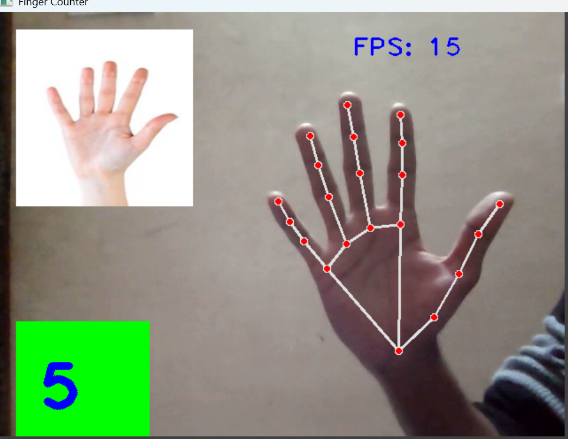

# 🖐️ Finger Counter Using OpenCV and MediaPipe

A real-time Finger Counter application built using Python, OpenCV, and MediaPipe. The project detects a user's hand through a webcam, identifies hand landmarks, and counts the number of fingers raised in real time.

---

## 🚀 Features

- Real-time finger counting
- Hand landmark detection using MediaPipe
- Live webcam feed using OpenCV
- Displays the total number of raised fingers
- Fast and lightweight implementation

---

## 🛠️ Technologies Used

- Python
- OpenCV
- MediaPipe
- NumPy

---

## 📂 Project Structure

```
Finger-Counter-Using-OpenCV-and-MediaPipe/
│
├── FingerImages/
├── FingerCountingProject.py
├── HandTrackingModule.py
├── finger-counter-demo.png
├── requirements.txt
├── README.md
└── .gitignore
```

---

## ⚙️ Installation

1. Clone the repository

```bash
git clone https://github.com/shashankdevadla-arch/Finger-Counter-Using-OpenCV-and-MediaPipe.git
```

2. Install dependencies

```bash
pip install -r requirements.txt
```

3. Run the project

```bash
python FingerCountingProject.py
```

---

## 📸 Project Demo

*(Replace this section with the image below after uploading `finger-counter-demo.png`.)*

```

```

---

## 💡 Future Improvements

- Hand gesture recognition
- Volume control using hand gestures
- Air mouse
- Brightness control
- Screenshot capture using gestures

---

## 👨‍💻 Author

**Shashank Dev Adla**

GitHub:
https://github.com/shashankdevadla-arch
